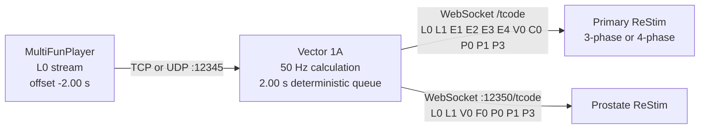

# Vector 1A

Vector 1A is a standalone live bridge from MultiFunPlayer T-code to one or two ReStim
instances. It does not require an AI model, GPU, cloud service, or voice stack. With an
ordinary positional `L0` stream, Vector remains the deterministic motion generator. When
MFP supplies a clearly authored ReStim axis set, Vector can automatically pass those axes
through on the same delayed timeline and generate only the missing axes.

Current development build: **1.6.0-alpha49**.

> [!CAUTION]
> Commission with ReStim's graphical display and stimulation hardware
> disconnected. Vector 1A is not a medical device and cannot make connected
> hardware, electrode placement, intensity, or generated signals safe.


### Alpha 48: session coordination and routing ownership

The MFP axis-routing window now shows whether each live axis is currently **AUTHORED** by MFP or **VECTOR** generated. Session startup can optionally launch MFP and one or two ReStim instances, wait for ReStim ports to become ready, connect them, and expose a single `SESSION: STARTING / READY / ATTENTION` state. These features are optional and disabled by default.

## Standalone by design

Vector 1A's signal engine, routing, orchestration and ReStim connections are entirely
local and deterministic. No language model or voice system is required. Future director
integrations can be layered above Vector as optional companions rather than becoming a
dependency of the core application.

## Signal path



The queue preserves sample timing and order independently of irregular MFP
input cadence. For phase-shifted prostate motion, two seconds of look-ahead is
recommended because slow strokes may reveal their reversal more than one
second after they begin.

## Features

- Authored-axis routing discovers MFP T-code axes at runtime and supports two policies.
  **Manual selected axes** provides per-axis checkboxes (including `L0`) so an authored
  value can replace the matching Vector-generated primary-ReStim axis or pass through as
  an additional T-code axis. **Auto authored ReStim set** detects unmistakably ReStim-style
  streams (for example `V0`, `C0`, `P0`, `P1`, `P3`, `E1-E4`) and passes the complete fresh
  authored set, including `L0`/`L1`, while Vector generates only missing axes. If the input
  falls back to ordinary `L0` only, Vector automatically resumes full generation. All
  authored values are sampled on their original MFP timeline and released with Vector's
  deterministic look-ahead delay. The routing dialog shows axes detected this session,
  axes currently live, and the active routing mode.
- Optional session startup can launch configured MultiFunPlayer, primary ReStim
  and prostate ReStim applications/shortcuts when Vector opens. Launching is kept
  separate from signal generation; Vector still owns its listener, connections,
  queue and output safety state.
- Four RFP/funscript-tools-compatible motion modes:
  - Circular 0-180
  - Top-Left to Bottom-Right 0-90 (default)
  - Top-Right to Bottom-Left 0-270
  - ReStim Original 0-360
- The two diagonal modes include their opposite internal 30-degree ReStim alignment
  corrections, so their A-B-C-B-A and A-C-B-C-A paths do not require manual
  Top rotation in ReStim.
- Configurable 1D-to-2D motion parameters and fixed output rate.
- Primary ReStim receives both 3-phase and 4-phase axes; ReStim uses the axes
  appropriate to its selected interface.
- Selectable four-phase electrode signalling sequences (`ABCD`, `ABDC`, `BACD`, `ACBD`),
  cycleable from the Xbox right shoulder button.
- Optional Rolling Variety signalling-sequence carousel with stable holds and
  short constant-energy transitions.
- Optional speed-adaptive four-phase crossover, with independent slow-motion
  and fast-motion widths plus a live effective-width display.
- Optional direction-dependent four-phase trajectory texture: reverse movement
  can use its own crossover curve, sharpness and width multiplier while
  retaining continuous stroke endpoints.
- Four-phase spatial response curves (linear, S-curve, endpoint emphasis and
  centre emphasis) with adjustable blending and preserved path endpoints;
  blend 0 is linear and blend 1 applies 100% of the selected response.
- Selectable four-phase spatial model: **Moving focus** hands stimulation from
  A through D, while **Depth spread** progressively retains reached electrodes
  so the active span accumulates with penetration and withdraws symmetrically.
  Depth spread includes adjustable tip retention, transition softness and a
  full-depth capture zone (default 5%) so near-endpoint scripts reach and hold
  E4 at 100%. Every E1-E4 frame is continuously projected into ReStim's
  required domain.
- Optional stroke-reversal emphasis uses buffered reversal points to apply a
  short proportional lift to the current volume at reversals anywhere in the
  stroke range. It changes intensity only; sample timing is preserved.
- Optional stroke-phase texture smoothly varies four-phase crossover width
  between independently adjustable acceleration and deceleration responses.
  Buffered stroke progress preserves continuity and output timing.
- Optional speed-linked variation depth fades jitter, continuous Rolling
  Variety modulation, spatial-response strength, adaptive/directional crossover,
  stroke-phase texture, reversal emphasis and slow volume overlay toward zero
  during pauses. It introduces them smoothly during slow motion and reaches
  their configured depth at an adjustable active-motion speed.
- Optional AB/CD timing separation delays physical A/B or C/D by up to 300 ms
  using interpolated output history. Positive values make A/B later; negative
  values make C/D later. Changes fade smoothly and can follow the speed-linked
  variation-depth envelope without changing Vector's synchronization queue.
- Optional moving sequence window follows each stroke: it begins and ends at
  the selected signalling sequence, smoothly biases toward the next sequence
  on forward motion or the previous sequence on reverse motion around
  mid-stroke, then returns. Depth and window width are adjustable; the slow
  sequence carousel takes priority when both options are selected.
- Depth spread applies the selected static signalling-sequence mapping after
  building logical A-B-C-D intensities. It bypasses the moving sequence window,
  Rolling Variety sequence carousel, crossover/direction/width textures and
  AB/CD timing separation so those transforms cannot invalidate the ReStim
  projection. Spatial response and volume-only reversal emphasis remain active;
  speed-linked depth continues to scale compatible spatial and volume effects.
- Dynamic volume reduction at rest and smooth return during movement.
- Live frequency, pulse-frequency, rise-time and pulse-width commissioning.
- Second ReStim output with tear-shaped prostate alpha/beta and independent
  prostate volume.
- Prostate alpha/beta timing phase from -90 to +90 degrees without rotating,
  tilting, or reducing the amplitude of the geometry.
- Keyboard-mapped Xbox controls and equal-length live range displays.
- Collapsible panels with live summaries.
- Plain-language in-app guides explain both the shared Motion controls and the
  Four-phase primary motion controls, including units, signs and live readouts.
- Persistent user settings and an in-app setup guide.
- Background ReStim connection recovery remains active even while output is
  stopped. Vector detects silently closed WebSockets, reconnects automatically,
  sends a zero-volume neutral frame before resuming live output, and records the
  recovery in a copyable timestamped connection log.
- MFP diagnostics distinguish a healthy listener with no recent L0 data from a
  listener transport failure; a quiet or paused script is not restarted merely
  because its values have stopped changing.
- Direct Windows Xbox controller input remains active when another window has
  focus; keyboard mappings remain available as a fallback.
- Rolling Variety smoothly modulates selected bounded controls over a
  configurable multi-minute cycle. Manual changes hold the selected target.
  Its always-visible toolbar button opens the controls; pulse ranges travel by
  +/-0.20 and prostate phase by +/-45 degrees. Each item has its own persisted
  cycle time, with staggered defaults of 4, 3, 2, 1, and 5 minutes.
- Neutral, Resume and Stop controls remain visible at the top of the window.
- Persistent four-phase A/B presets capture the complete transform setup, with
  editable names, a clean Baseline, modified-state indication and smooth
  configurable transitions. Use `[` / `]` or hold Xbox LB and press RB to
  compare A and B without navigating the controls.

## Requirements

- Windows 10 or 11
- Python 3.11 or newer with Tkinter
- MultiFunPlayer
- ReStim; a second instance is optional for prostate output

Vector itself has no third-party Python package dependencies.

## Quick start

1. Download and extract the release ZIP.
2. Double-click `start-vector1a.bat`.
3. Leave stimulation hardware disconnected.
4. In MFP, add a T-code TCP or UDP output to `127.0.0.1:12345`, carrying `L0`.
5. Set the MFP script offset to **-2.00 seconds**.
6. In primary ReStim, enable its **WebSocket server** and enter that port in
   Vector (normally `12346`). Do not enter ReStim's TCP port (commonly `12347`):
   Vector's ReStim outputs use WebSocket `/tcode`, not TCP.
7. Optionally run a second ReStim WebSocket server on port `12350` for prostate
   output.
8. In Vector, start the listener, connect the output(s), then choose
   **Start / Resume**. Alternatively, open **Session startup** to configure
   optional one-click launching of MFP and either ReStim instance.
9. If MFP is also streaming non-`L0` axes, open **MFP axes** and tick only the
   authored axes you want sent to the Primary ReStim. Unchecked axes leave
   Vector's generated behaviour unchanged.
10. Fine-tune synchronization in MFP around -2.00 seconds while leaving Vector's
   delay at 2.00 seconds.

The **Setup guide** button repeats these instructions. Settings are saved at
`%LOCALAPPDATA%\Vector1A\settings.json`; deleting that file restores defaults.

### Stroke-reversal emphasis

This optional shared 3-phase/four-phase transform briefly lifts intensity around actual
buffered stroke reversals without changing motion geometry or sample timing.
Its live value runs from `0` away from a reversal to `1` at the reversal.

The boost is a proportion of the current output. For example, **Current-volume
boost** `0.20` means up to +20%: current volume `0.40` becomes `0.48`, while
`0.80` becomes `0.96`. Output is always clamped at `1.00`. A clear commissioning
test is:

- **Window:** `0.40 s`
- **Current-volume boost:** `0.20`

Commission visually with stimulation hardware disconnected before connected use.

### Motion controls in plain language

- **Base volume** is the normal volume before dynamic volume response and
  direction-dependent texture are applied.
- **Smooth L0 position variation** moves the motion coordinate, not volume.
  Maximum shift `0.10` permits approximately `-0.10` to `+0.10` around the
  scripted L0 position, clipped to the valid 0-1 range.
- **Scale optional effects with speed** is a shared master depth. Effects fade
  toward zero at rest, reach full configured depth at **Full effects at speed**,
  and follow changes with the selected **Response time**.
- **Spatial response** reshapes progress along a path while preserving its
  endpoints. Blend `0` is linear and blend `1` fully applies the chosen curve.
- **Boost volume near stroke reversal** raises current volume proportionally
  inside the selected window.
- **Stroke-phase texture** applies separate volume multipliers while L0 is
  rising and falling.

## Output axes

| Destination | Axis | Meaning |
|---|---|---|
| Primary ReStim | L0 / L1 / V0 | Alpha / beta / volume |
| Primary ReStim | E1 / E2 / E3 / E4 | Four-phase electrode potentials |
| Primary ReStim | C0 | Frequency |
| Primary ReStim | P0 / P1 / P3 | Pulse frequency / width / rise time |
| Prostate ReStim | L0 / L1 / V0 | Alpha-prostate / beta-prostate / volume-prostate |
| Prostate ReStim | F0 / P0 / P1 / P3 | Shared frequency and pulse controls |

## Controller mapping

The supplied Xbox profile maps controller buttons to keyboard keys. Vector
ignores these shortcuts while a text or numeric field has focus.

With **Direct Xbox input** enabled, Vector reads the controller through Windows
XInput even while MFP or ReStim has focus: D-pad up/down changes frequency;
D-pad left/right shifts pulse frequency; hold LB for rise (up/down) and width
(left/right); X/Y changes prostate phase; A resumes; B selects Neutral; and the
Menu button stops. Disable direct input to use only the keyboard profile.

| Keys | Action |
|---|---|
| W / S | Frequency ramp up / down |
| A / D | Pulse-frequency range down / up |
| I / K | Pulse-rise range up / down |
| J / L | Pulse-width range down / up |
| X / Page Up | Prostate timing phase ahead |
| Y / Page Down | Prostate timing phase behind |
| Enter / Space / Escape | Resume / Neutral / Stop |

## Development

Run from the repository root:

```powershell
python -m vector1a
python -m unittest discover -s tests -v
```

Create the source-based Windows release ZIP by running `build-release.bat`, or:

```powershell
powershell -ExecutionPolicy Bypass -File .\build-release.ps1
```

## Algorithm and protocol baseline

This independent implementation was developed for behavioral and protocol
compatibility with:

- [edger477/funscript-tools](https://github.com/edger477/funscript-tools),
  revision `7cecc013061f9c4851850fef8f31f7e52d97aa88`
- [diglet48/restim](https://github.com/diglet48/restim), revision
  `5c0605304a024208b079d37895ca2ff7f5d54720`

Both upstream projects are MIT-licensed. See `THIRD_PARTY_NOTICES.md` for
copyright and license details.

## License

Vector 1A is available under the MIT License. See `LICENSE`.


## Alpha 44 MFP axis diagnostics

Alpha 44 makes authored-axis discovery more tolerant and observable. The MFP listener now accepts both whitespace-separated and concatenated T-code packets, and the **MFP axes** window shows recent raw packets beside the axis names parsed from them. This is diagnostic only unless an authored axis checkbox is explicitly enabled; all authored-axis routing remains off by default.


## Alpha 45 authored routing policy

Alpha 45 adds two routing policies in **MFP axes**. **Manual selected axes** allows any detected axis, including `L0`, to replace Vector's generated value on the same delayed timeline. `V0` is labelled as Primary volume to distinguish it from additional volume axes such as `V1`. **Auto authored ReStim set** detects a ReStim-semantic stream by the presence of axes such as `V0`, `C0`, `P0`, `P1`, `P3`, or `E1`-`E4`. When detected, Vector passes the complete authored axis set, including `L0` and `L1`, while continuing to generate only missing axes. A plain positional `L0` stream remains in normal Vector-generation mode.


## Alpha 46 delayed-timeline authored routing fix

Alpha 46 fixes automatic authored ReStim routing when Vector is using its normal look-ahead delay.  Alpha 45 tested axis freshness against the newest packet currently held in history; because that newest packet is usually later than the delayed sample's original calculation time, the auto router could incorrectly return no overrides.  Alpha 46 evaluates freshness using the newest authored packet that existed at the delayed sample time.  This makes authored `V0`, `L0`, `L1`, and the rest of the detected ReStim set win at the final Primary ReStim merge while preserving Vector's synchronized delay and generated fallback for genuinely missing axes.
