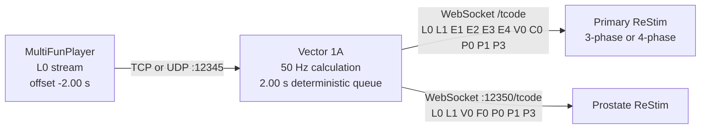

# Vector 1A

Vector 1A is a live bridge from one MultiFunPlayer `L0` T-code stream to one or
two ReStim instances. It converts streamed 1D motion into synchronized alpha,
beta, volume, frequency and pulse controls at a stable internal cadence.

Current development build: **1.6.0-alpha32**.

> [!CAUTION]
> Commission with ReStim's graphical display and stimulation hardware
> disconnected. Vector 1A is not a medical device and cannot make connected
> hardware, electrode placement, intensity, or generated signals safe.

## Signal path



The queue preserves sample timing and order independently of irregular MFP
input cadence. For phase-shifted prostate motion, two seconds of look-ahead is
recommended because slow strokes may reveal their reversal more than one
second after they begin.

## Features

- Four RFP/funscript-tools-compatible motion modes:
  - Circular 0-180
  - Top-Left to Bottom-Right 0-90 (default)
  - Top-Right to Bottom-Left 0-270
  - ReStim Original 0-360
- Configurable 1D-to-2D motion parameters and fixed output rate.
- Primary ReStim receives both 3-phase and 4-phase axes; ReStim uses the axes
  appropriate to its selected interface.
- Selectable four-phase electrode signalling sequences (`ABCD`, `ABDC`, `BACD`, `ACBD`),
  cycleable from the Xbox right shoulder button.
- Optional Rolling Variety signalling-sequence carousel with stable holds and
  short constant-energy transitions.
- Optional speed-adaptive four-phase crossover, with independent slow-motion
  and fast-motion widths plus a live effective-width display.
- Optional direction-dependent four-phase trajectory texture: reverse movement
  can use its own crossover curve, sharpness and width multiplier while
  retaining continuous stroke endpoints.
- Four-phase spatial response curves (linear, S-curve, endpoint emphasis and
  centre emphasis) with adjustable blending and preserved path endpoints;
  blend 0 is linear and blend 1 applies 100% of the selected response.
- Optional stroke-reversal emphasis uses buffered reversal points to apply a
  short, bounded lift from available volume headroom at reversals anywhere in
  the stroke range. It changes intensity only; sample timing is preserved.
- Optional stroke-phase texture smoothly varies four-phase crossover width
  between independently adjustable acceleration and deceleration responses.
  Buffered stroke progress preserves continuity and output timing.
- Dynamic volume reduction at rest and smooth return during movement.
- Live frequency, pulse-frequency, rise-time and pulse-width commissioning.
- Second ReStim output with tear-shaped prostate alpha/beta and independent
  prostate volume.
- Prostate alpha/beta timing phase from -90 to +90 degrees without rotating,
  tilting, or reducing the amplitude of the geometry.
- Keyboard-mapped Xbox controls and equal-length live range displays.
- Collapsible panels with live summaries.
- Persistent user settings and an in-app setup guide.
- Direct Windows Xbox controller input remains active when another window has
  focus; keyboard mappings remain available as a fallback.
- Rolling Variety smoothly modulates selected bounded controls over a
  configurable multi-minute cycle. Manual changes hold the selected target.
  Its always-visible toolbar button opens the controls; pulse ranges travel by
  +/-0.20 and prostate phase by +/-45 degrees. Each item has its own persisted
  cycle time, with staggered defaults of 4, 3, 2, 1, and 5 minutes.
- Neutral, Resume and Stop controls remain visible at the top of the window.
- Persistent four-phase A/B presets capture the complete transform setup, with
  editable names, a clean Baseline, modified-state indication and smooth
  configurable transitions. Use `[` / `]` or hold Xbox LB and press RB to
  compare A and B without navigating the controls.

## Requirements

- Windows 10 or 11
- Python 3.11 or newer with Tkinter
- MultiFunPlayer
- ReStim; a second instance is optional for prostate output

Vector itself has no third-party Python package dependencies.

## Quick start

1. Download and extract the release ZIP.
2. Double-click `start-vector1a.bat`.
3. Leave stimulation hardware disconnected.
4. In MFP, add a T-code TCP or UDP output to `127.0.0.1:12345`, carrying `L0`.
5. Set the MFP script offset to **-2.00 seconds**.
6. In primary ReStim, enable its **WebSocket server** and enter that port in
   Vector (normally `12346`). Do not enter ReStim's TCP port (commonly `12347`):
   Vector's ReStim outputs use WebSocket `/tcode`, not TCP.
7. Optionally run a second ReStim WebSocket server on port `12350` for prostate
   output.
8. In Vector, start the listener, connect the output(s), then choose
   **Start / Resume**.
9. Fine-tune synchronization in MFP around -2.00 seconds while leaving Vector's
   delay at 2.00 seconds.

The **Setup guide** button repeats these instructions. Settings are saved at
`%LOCALAPPDATA%\Vector1A\settings.json`; deleting that file restores defaults.

### Stroke-reversal emphasis

This optional four-phase transform briefly lifts intensity around actual
buffered stroke reversals without changing motion geometry or sample timing.
Its live value runs from `0` away from a reversal to `1` at the reversal.

The effect uses only the headroom above **Volume ceiling**. For example, a
ceiling of `0.90` with **Headroom use** at `0.25` can add at most 2.5 percentage
points and may be difficult to notice. A clear commissioning test is:

- **Volume ceiling:** `0.70`
- **Window:** `0.40 s`
- **Headroom use:** `1.00`

Once confirmed, reduce **Headroom use** or raise **Volume ceiling** to taste.
As a rough guide, a ceiling near `0.90` is subtle, `0.80` is moderate, and
`0.70` is pronounced when full headroom is enabled. Commission visually with
stimulation hardware disconnected before connected use.

## Output axes

| Destination | Axis | Meaning |
|---|---|---|
| Primary ReStim | L0 / L1 / V0 | Alpha / beta / volume |
| Primary ReStim | E1 / E2 / E3 / E4 | Four-phase electrode potentials |
| Primary ReStim | C0 | Frequency |
| Primary ReStim | P0 / P1 / P3 | Pulse frequency / width / rise time |
| Prostate ReStim | L0 / L1 / V0 | Alpha-prostate / beta-prostate / volume-prostate |
| Prostate ReStim | F0 / P0 / P1 / P3 | Shared frequency and pulse controls |

## Controller mapping

The supplied Xbox profile maps controller buttons to keyboard keys. Vector
ignores these shortcuts while a text or numeric field has focus.

With **Direct Xbox input** enabled, Vector reads the controller through Windows
XInput even while MFP or ReStim has focus: D-pad up/down changes frequency;
D-pad left/right shifts pulse frequency; hold LB for rise (up/down) and width
(left/right); X/Y changes prostate phase; A resumes; B selects Neutral; and the
Menu button stops. Disable direct input to use only the keyboard profile.

| Keys | Action |
|---|---|
| W / S | Frequency ramp up / down |
| A / D | Pulse-frequency range down / up |
| I / K | Pulse-rise range up / down |
| J / L | Pulse-width range down / up |
| X / Page Up | Prostate timing phase ahead |
| Y / Page Down | Prostate timing phase behind |
| Enter / Space / Escape | Resume / Neutral / Stop |

## Development

Run from the repository root:

```powershell
python -m vector1a
python -m unittest discover -s tests -v
```

Create the source-based Windows release ZIP by running `build-release.bat`, or:

```powershell
powershell -ExecutionPolicy Bypass -File .\build-release.ps1
```

## Algorithm and protocol baseline

This independent implementation was developed for behavioral and protocol
compatibility with:

- [edger477/funscript-tools](https://github.com/edger477/funscript-tools),
  revision `7cecc013061f9c4851850fef8f31f7e52d97aa88`
- [diglet48/restim](https://github.com/diglet48/restim), revision
  `5c0605304a024208b079d37895ca2ff7f5d54720`

Both upstream projects are MIT-licensed. See `THIRD_PARTY_NOTICES.md` for
copyright and license details.

## License

Vector 1A is available under the MIT License. See `LICENSE`.
